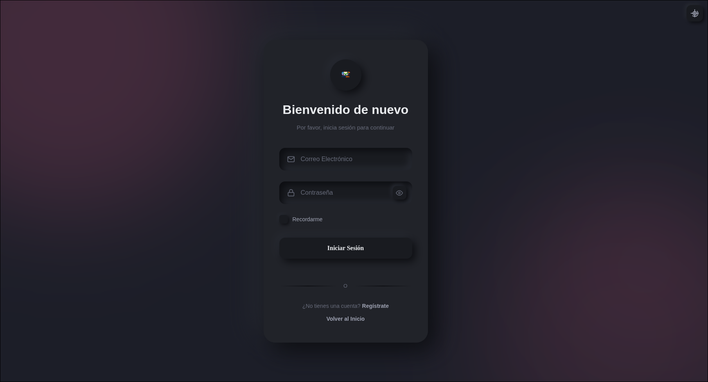
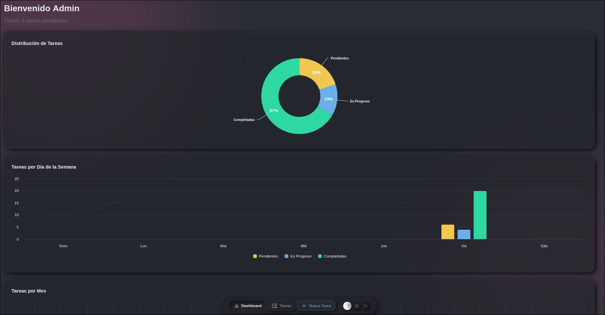
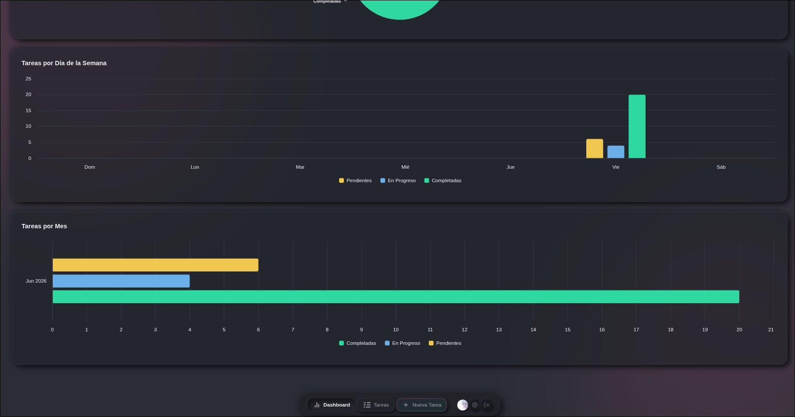
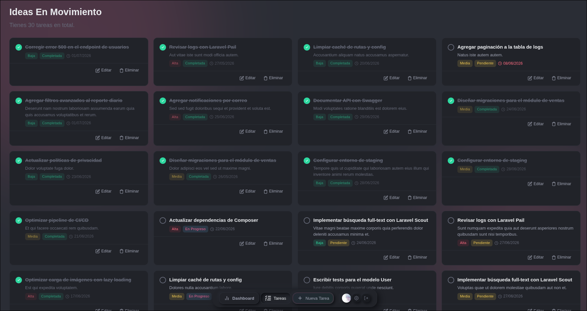
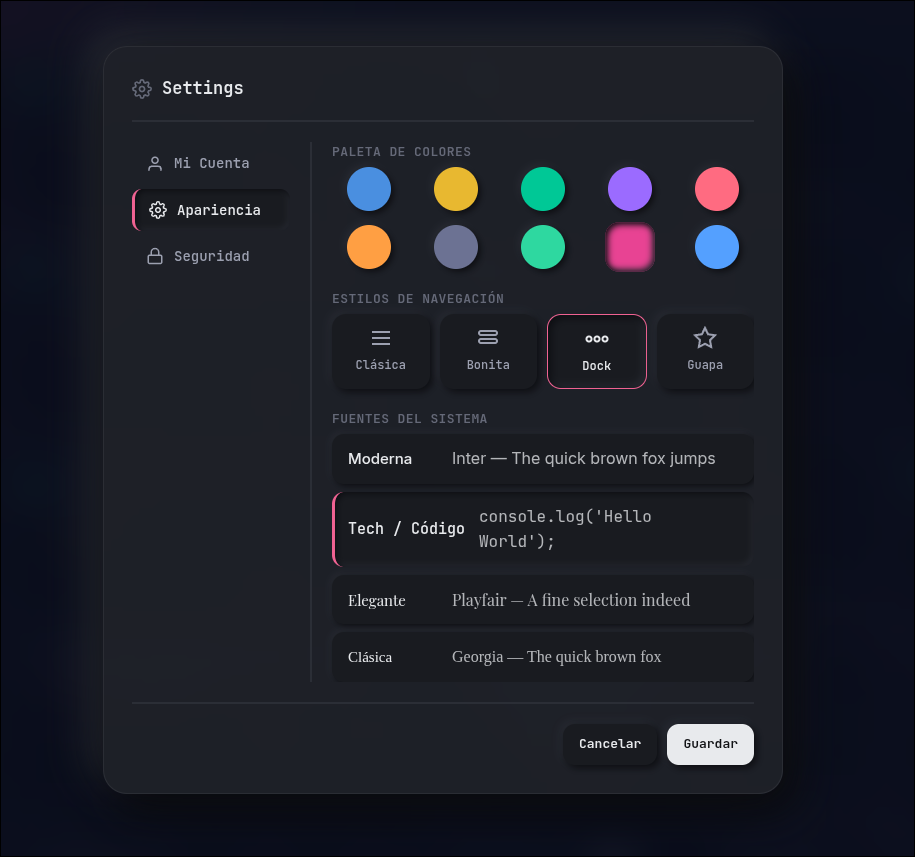

<div align="center">
  <h1>TaskManager</h1>
  <p><strong>Panel de tareas neumórfico con dashboard, gráficos y personalización completa</strong></p>

  <p>
    
    
    
    
    
    
    
  </p>
</div>

---

## 📋 Descripción

TaskManager es un sistema de gestión de tareas con un diseño **neumórfico moderno**, desarrollado como primer proyecto completo con Laravel. Cuenta con un panel de control con gráficos estadísticos, CRUD completo de tareas, 10 temas de color, 4 estilos de navegación, modo oscuro automático y animaciones fluidas con GSAP.

> **Nota:** Este es mi primer proyecto completo, por lo que es posible que encuentres algunos detalles visuales o de funcionamiento. Si encuentras algún error, no dudes en reportarlo.

---

## Características

### Gestión de Tareas
- CRUD completo (Crear, Leer, Actualizar, Eliminar)
- Filtros por estado y prioridad (sin recarga de página)
- Cambio rápido de estado con checkbox AJAX
- Prevención de tareas duplicadas
- Fechas límite con resaltado de vencidas
- Soft deletes (eliminación suave)

### Dashboard
- 3 gráficos interactivos (Highcharts): donut, semanal agrupado, mensual
- Tarjetas de estadísticas con animación de conteo
- Estados vacíos con ilustraciones SVG
- Datos actualizados en tiempo real

### Personalización
- **10 temas de color**: Ocean, Sunset, Forest, Lavender, Rose, Amber, Slate, Teal, Berry, Sky
- **4 estilos de navegación**: Classic, Pretty, Dock (barra flotante), Guapa
- **4 fuentes del sistema**: Moderna (Inter), Tech (JetBrains Mono), Elegante (Playfair Display), Clásica (Georgia)
- Modo oscuro/claro automático (sigue la preferencia del sistema)
- Persistencia de todas las preferencias en localStorage

### Diseño y UX
- **Diseño neumórfico**: Sombras suaves extrudidas/inset en toda la interfaz
- **Glassmorphism**: Modales, sidebar y tarjetas con `backdrop-filter: blur()`
- **Ambient glow blobs**: Círculos borrosos de fondo que se adaptan al color del tema
- **Animaciones GSAP**: Transiciones de página, apertura de modales con Flip, contadores animados, entrada escalonada de tarjetas
- **Sistema de toasts**: Notificaciones deslizables con 4 tipos (éxito, error, advertencia, info)
- **PrettyModal**: Modales animados con efecto Flip y persistencia de borradores
- **Avatar**: Recorte y carga de avatar con Cropper.js (almacenado en localStorage)

### Autenticación
- Registro e inicio de sesión con diseño neumórfico
- Confirmación de cierre de sesión con modal
- Redirección con mensajes de bienvenida
- Páginas de login/register con selector de paleta de colores

---

## Capturas de Pantalla

### Landing


### Login


### Dashboard — Vista Superior


### Dashboard — Vista Inferior


### Tareas


### Ajustes


---

## 🛠️ Stack Tecnológico

| Tecnología | Versión |
|------------|---------|
| **Laravel** | ^13.0 |
| **PHP** | ^8.3 |
| **MySQL** | Última estable |
| **Tailwind CSS** | ^4 (vía `@tailwindcss/vite`) |
| **Vite** | ^8 |
| **GSAP** | ^3.15 (Core, Flip, CustomEase, SplitText) |
| **Highcharts** | Última (CDN) |
| **Cropper.js** | ^1.6.1 |
| **Axios** | ^1.11 |

---

## 🚀 Instalación

### Requisitos previos

- PHP ^8.3
- Composer
- MySQL
- Node.js & npm

### Pasos

```bash
# 1. Clonar el repositorio
git clone <url-del-repositorio>
cd taskmanager

# 2. Instalar dependencias de PHP
composer install

# 3. Configurar el archivo de entorno
cp .env.example .env
# Editar .env con tus credenciales de base de datos:
#   DB_CONNECTION=mysql
#   DB_HOST=127.0.0.1
#   DB_PORT=3306
#   DB_DATABASE=taskmanager
#   DB_USERNAME=root
#   DB_PASSWORD=

# 4. Generar clave de aplicación
php artisan key:generate

# 5. Ejecutar migraciones y seeders
php artisan migrate --seed

# 6. Instalar dependencias frontend
npm install

# 7. Compilar assets
npm run build

# 8. Iniciar el servidor
php artisan serve
```

Luego abre `http://localhost:8000` en tu navegador.

---

## 🧪 Pruebas

```bash
composer test
```

El proyecto incluye tests básicos con PHPUnit y una base de datos SQLite en memoria para el entorno de pruebas.

---

## 📁 Estructura del Proyecto

```
├── app/
│   ├── Http/Controllers/
│   │   ├── TaskController.php      → CRUD de tareas
│   │   ├── SettingsController.php  → Actualizar display_name
│   │   └── Auth/
│   │       ├── LoginController.php
│   │       └── RegisterController.php
│   └── Models/
│       ├── Task.php                → SoftDeletes, relaciones
│       ├── TaskState.php
│       ├── PriorityType.php
│       └── User.php
├── resources/
│   ├── views/
│   │   ├── welcome.blade.php       → Landing page
│   │   ├── dashboard.blade.php     → Panel con gráficos
│   │   ├── tasks.blade.php         → Lista de tareas
│   │   ├── auth/                   → Login & Register
│   │   └── partials/               → Sidebar, modales, tareas
│   └── css/
│       ├── app.css                 → Entry point Vite
│       └── nav-styles.css          → Estilos de navegación
├── public/
│   ├── css/
│   │   ├── theme.css               → Variables CSS base
│   │   ├── dashboard.css           → Estilos del dashboard
│   │   ├── custom-themes.css       → 10 temas de color
│   │   ├── nav-styles.css          → 4 estilos de navegación
│   │   └── login.css               → Estilos de login/register
│   └── js/
│       ├── theme.js                → Inicialización de tema
│       ├── dashboard.js            → Lógica del sidebar, toasts
│       ├── charts.js               → Gráficos Highcharts
│       ├── settings-tabs.js        → Modal de ajustes
│       └── PrettyModal.js          → Sistema de modales animados
├── routes/web.php
├── composer.json
├── package.json
└── vite.config.js
```

---

## 🤝 Contribuciones

Las contribuciones son bienvenidas. Si encuentras algún error o tienes una sugerencia:

1. Abre un [issue](<url-del-repo>/issues)
2. Crea un [pull request](<url-del-repo>/pulls)

---

## 📄 Licencia

Este proyecto está bajo la licencia **MIT**. Consulta el archivo `LICENSE` para más detalles.

---

<div align="center">
  <sub>Hecho por <a href="https://github.com/saepear">Chris</a> y <a href="https://github.com/jhannlozano934">Jhann</a></sub>
</div>
